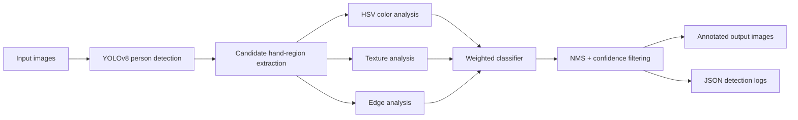

# Glove Compliance Detection System

Computer vision pipeline for detecting **gloved** vs. **ungloved** hands in factory/safety images.

The project combines a pretrained **YOLOv8 person detector** with custom OpenCV-based hand-region classification. It is designed as a practical safety-compliance prototype: batch images go in, annotated images and structured JSON audit logs come out.

## Why This Exists

In factory and industrial environments, PPE compliance checks are often manual, slow, and inconsistent. This project explores a lightweight approach for flagging whether visible hands appear gloved or bare without requiring a large domain-specific training dataset upfront.

It is intentionally built as a hybrid system:

- YOLOv8 handles robust person localization.
- Hand regions are inferred from person boxes.
- OpenCV color, texture, and edge features classify regions as `gloved_hand` or `bare_hand`.
- Each processed image produces machine-readable JSON logs for downstream review or audit workflows.

## Pipeline



## Features

- Batch processing for image folders.
- `gloved_hand` / `bare_hand` classification.
- Confidence thresholding.
- Non-maximum suppression for overlapping detections.
- Annotated output images with labels and bounding boxes.
- Per-image JSON logs suitable for audit/review pipelines.
- Optional multiprocessing for larger batches.
- Synthetic sample-image generation for quick local testing.

## Repository Structure

```text
.
├── Part_1_Glove_Detection/
│   ├── detection_script.py   # CLI and detection pipeline
│   ├── logs/                 # Example JSON outputs
│   └── output/               # Example annotated images
├── requirements.txt
└── README.md
```

## Setup

Python 3.10+ is recommended.

```bash
python -m venv .venv
source .venv/bin/activate
pip install -r requirements.txt
```

The first run may download `yolov8n.pt` through Ultralytics if the model file is not already present.

## Usage

Run from the repo root:

```bash
python Part_1_Glove_Detection/detection_script.py \
  --input path/to/images \
  --output Part_1_Glove_Detection/output \
  --logs Part_1_Glove_Detection/logs
```

Adjust confidence:

```bash
python Part_1_Glove_Detection/detection_script.py \
  --input path/to/images \
  --confidence 0.7
```

Use CPU/GPU explicitly:

```bash
python Part_1_Glove_Detection/detection_script.py \
  --input path/to/images \
  --device cpu
```

Enable multiprocessing:

```bash
python Part_1_Glove_Detection/detection_script.py \
  --input path/to/images \
  --multiprocessing
```

Create synthetic sample images:

```bash
python Part_1_Glove_Detection/detection_script.py --create-samples
```

## CLI Options

| Option | Purpose | Default |
|---|---|---|
| `--input` | Directory containing input images | Required unless `--create-samples` is used |
| `--output` | Directory for annotated images | `output` |
| `--logs` | Directory for JSON detection logs | `logs` |
| `--confidence` | Minimum confidence threshold | `0.5` |
| `--model` | YOLO model path | `yolov8n.pt` |
| `--device` | `auto`, `cpu`, or `cuda` | `auto` |
| `--multiprocessing` | Process multiple images in parallel | Disabled |
| `--create-samples` | Generate simple sample images | Disabled |

## Output Format

For every processed image, the system writes:

- An annotated image with bounding boxes and labels.
- A JSON file with detections.

Example:

```json
{
  "filename": "factory_frame_001.jpg",
  "detections": [
    {
      "label": "gloved_hand",
      "confidence": 0.92,
      "bbox": [120.0, 80.0, 210.0, 190.0]
    },
    {
      "label": "bare_hand",
      "confidence": 0.84,
      "bbox": [310.0, 95.0, 385.0, 205.0]
    }
  ]
}
```

## Detection Logic

The classifier uses three signals:

| Signal | Weight | Rationale |
|---|---:|---|
| HSV color analysis | 50% | Industrial gloves commonly have strong color patterns: blue, yellow, white, green, purple, or black |
| Texture analysis | 30% | Glove surfaces are often more uniform than skin regions |
| Edge analysis | 20% | Glove boundaries can produce clearer edge patterns |

Final labels are produced from the weighted score and filtered by confidence threshold. Overlapping candidate boxes are reduced with non-maximum suppression.

## Current Performance

Observed performance on the included synthetic/test cases is approximately **85-90% accuracy**, depending on image quality and threshold selection. This is not presented as a production benchmark; it is a prototype result from a limited test set.

The strongest part of the project is the complete pipeline shape: detection, classification, confidence filtering, annotated artifacts, and structured logs.

## Limitations

- Hand boxes are estimated from person detections, not from a dedicated hand detector.
- Complex poses, occlusion, and small/distant hands can reduce accuracy.
- Very poor lighting or unusual glove colors can produce false classifications.
- The classifier uses classical CV features rather than a trained glove-specific model.
- The included examples are useful for demonstration, but a real deployment would need a labeled validation set from the target camera environment.

## Production Improvements

The next version should focus on measurement and domain adaptation:

1. Collect a domain-specific labeled dataset from real factory camera angles.
2. Train or fine-tune a glove/hand detector instead of inferring hand regions from person boxes.
3. Add an evaluation script with precision, recall, F1, confusion matrix, and threshold sweeps.
4. Add frame-level aggregation for video streams to reduce single-frame noise.
5. Package the detector as a FastAPI service for review workflows and dashboard integration.

## Tech Stack

- Python
- YOLOv8 / Ultralytics
- OpenCV
- NumPy
- PyTorch

## Notes

This project is a safety-compliance prototype and should not be used as the only enforcement mechanism in a real industrial setting. It is intended to demonstrate practical computer-vision pipeline design, batch processing, structured logging, and honest handling of model limitations.
